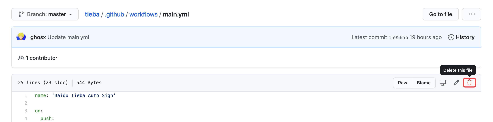
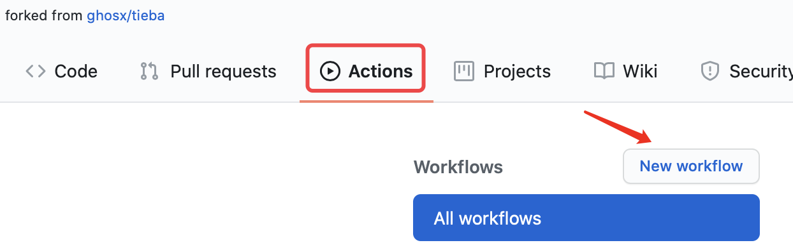
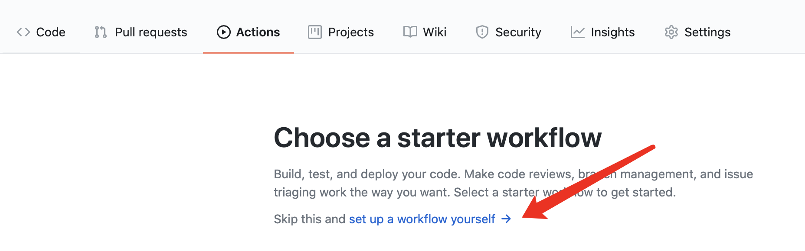
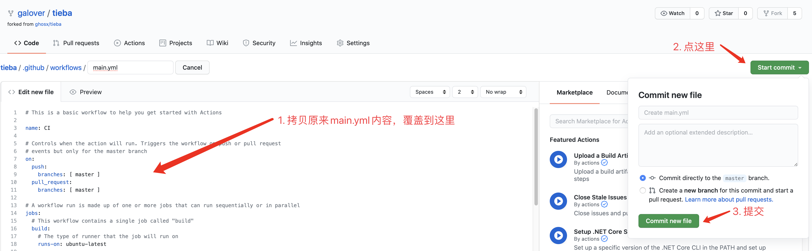

# 贴吧签到Github Action版

## 今日签到状态

## 使用说明

1. Fork 本仓库，然后点击你的仓库右上角的 Settings，找到 Secrets 这一项，添加一个秘密环境变量。

其中 `BDUSS` 存放你的 BDUSS 。支持同时添加多个帐户，BDUSS 之间用半角逗号 `#` 隔开即可。

2. 设置好环境变量后点击你的仓库上方的 `Actions` 选项，第一次打开需要点击 `I understand...` 按钮，确认在 Fork 的仓库上启用 GitHub Actions 。
3. Github无法自动根据文件启用workflow，因此删除原来的main.yml文件，可以把该文件内容复制保存到电脑。

4. 新建workflow，如图，依次点击action，`New workflow`。

5. 在新页面中如图点击`set up ... yourself`。

6. 如下图流程，将原来的main.yml中内容替换到文本框内，依次点击`Start commit`、`Commit new file`提交。

7. 至此自动签到就搭建完毕了，可以再次点击`Actions`查看工作记录，如果有`Baidu Tieba Auto Sign`则说明workflow创建成功了。点击右侧记录可以查看详细签到情况。

## 讨论群

TG： https://t.me/tiebasign

qq群： 818794879

